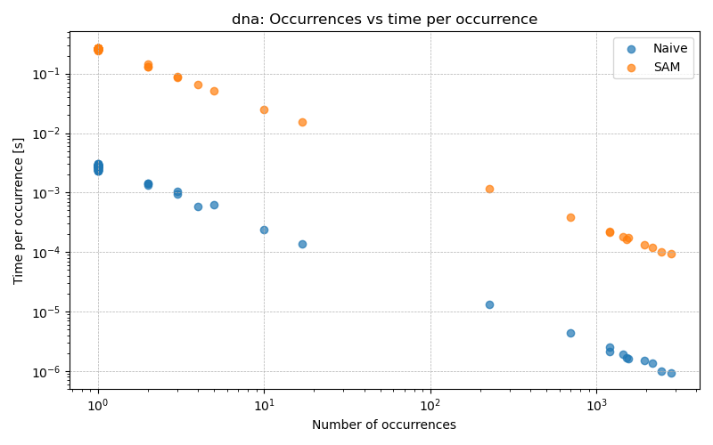
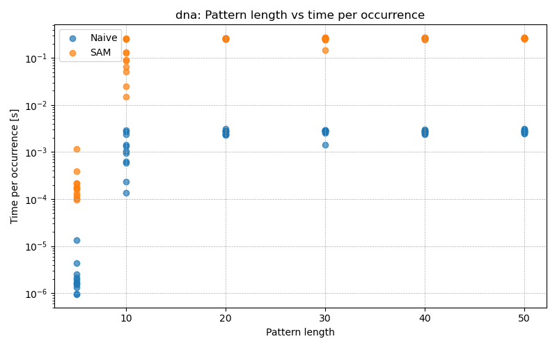
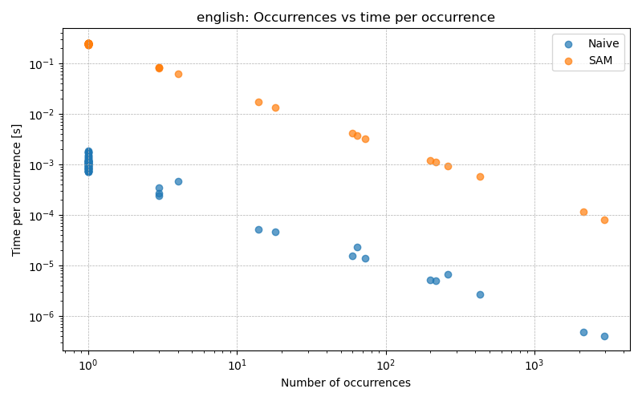
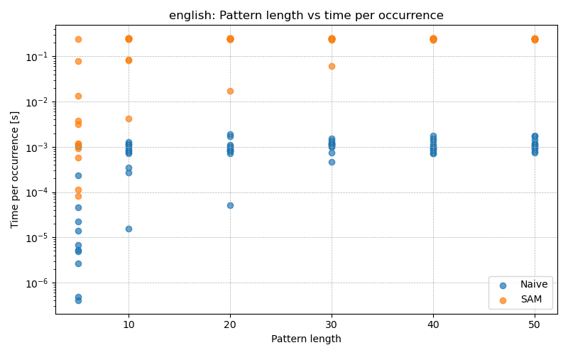
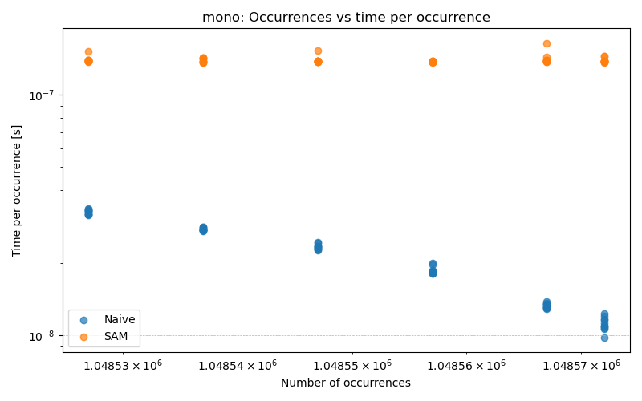
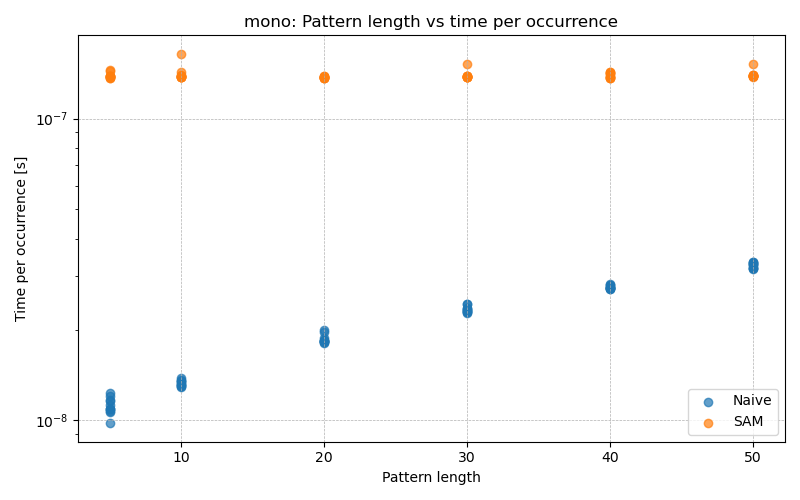
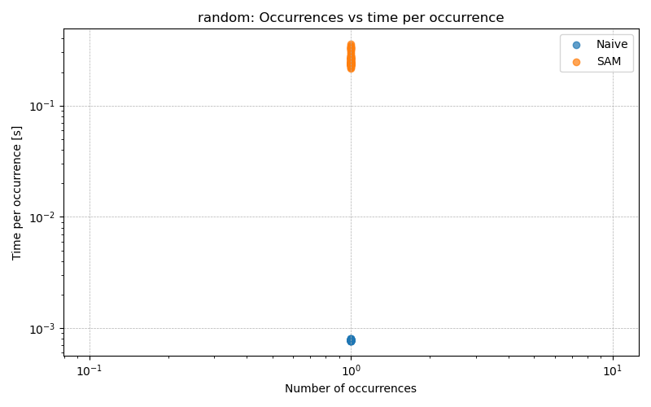
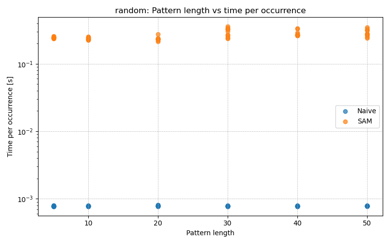

#   Semestral work report B251
-   Implementation Language: **python**

##  Implementation and data structure design
-   What construction algorithm did you choose and why?

I used Suffix-Automaton-Online algorithm as described in provided lecture materials. The extension function was implemented also according to the lecture materials  - function Extension(a ∈ Σ). 

-   Did you need any additional computation to answer all of the queries for matching? If yes, what and how did you integrate it? 

	- for **count()** I had to implement occurrence counter. Every new state has one occurrence upon initialization. However since the pattern can be just the suffix of the state. States representing shorter stings have more occurrences. After the extension phase in build function I ordered states from longest to shortest and added up their occurrences following their suffix links.

	- for **match_first()** and **match_last()** I applied similar idea to implementation of count(). Only difference is that it does not make sense to add up first or last occurrence. The minimum and maximum of first and last occurrence respectively are calculated between state and its suffix link.  

	- **match_all()** method was more challenging to implement. Applying the same logic as in previous methods would work. However, the time and memory complexity would be $O(n^2)$ which would be exploited later on by _mono dataset_. The chose approach was _suffix link tree_ + _depth first search (DFS)_ to navigate it efficiently. [link](https://cp-algorithms.com/string/suffix-automaton.html#all-occurrence-positions)

-   Did you have any troubles you want to share with your implementation?

Get the understanding for suffixlink tree and DFS took some time and effort.

##  LCF Algorithm design
-   Describe and write pseudocode of your algorithm

```
Algorithm: LCF
Input: string x, string y
Output: list of all statrting possitions in string x of longest pattern x in text y and length l of matchion pattern
SAM <- SuffixAutomaton(x)
best_length <- 0
best_states <- Empty_list
cur_length <- 0
state <- 0
# walk y
for letter <- 0..(|y| - 1) do
        if letter not in SAM[next[state]] then  # check for transitions
                cur_length <- cur_length +1
                state <- SAM[next[state[letter]]]
        else
                repeat
                        cur_length <- cur_length +1     # walk suffix links
                        state <- SAM[suffix_link[state]]
                until state == 0 or letter in SAM[next[state]]

                if letter in SAM[next[state]] then
                        cur_length <- cur_length +1
                        state <- SAM[next[state[letter]]]
                else
                        cur_length <- 0         # reset root

        if cur_length > best_length then        # update best_lenght
                best_length <- cur_length
                best_states <- Empty_list
                best_states[0] <- state
        else
                if cur_length > best_length then
                        append state to best_states

    if best_len == 0:   # no common substring, return ([], 0)
        return (Empty_list, 0)

    hits <- Empty_list
    l <- best_len

    for state in best_states do
        t_in  <- SAM[tin[state]]
        t_out <- SAM[tout[state]]

        for i <- 0..(|x| - 1) do        # scan all end positions i in x
            st <- SAM[state_at_pos[i]]

            if t_in ≤ SAM.tin[st] ≤ t_out:      # subtree of state
                start_pos <- i - l + 1   # substring x[start_pos .. i] has length l
                append start_pos to hits
return hits, l
```
-   Analyse time and memory consumption

Time:

Nested loop in the hit collection phase can be of time complexity $O(n^2)$ for short LCF and long string y. Therefore the time complexity can be expressed as follows:

$|x| = n; |y| = m$

$$
SAM.build + DFS\space over\space suffix\space tree + scanning\space of\space y + collecting the hit possitions in x (nested loop) =
$$
$$
= O(n) + O(n) + O(m) + O(n^2) = O(n^2)
$$

Space complecxity:

- max(SAM state) = 2n + 1 --> O(n)
- There are max 1 tin, tout per state and best states. --> O(n)
- There are max n state_at_position and hits. --> O(n)

Therefore the final space complexity is $O(n)$.

##  Experiment results
-   Import your graphs from the experiments

Table 1: Overall SAM statistics

| dataset | construction time [s] | n_states | n_transitions |
|---------|:---------------:|:--------:|:-------------:|
| dna     | 11.33           | 1739736  | 2641078       |
| english | 9.65            | 1612015  | 2280703       |
| mono    | 4.48            | 1048577  | 1048576       |
| random  | 8.47            | 1358613  | 2405065       |

Graphical result for searching in SAM for all datasets (search time normalisation by occurrences on the left, by pattern length on the right):

|   |   |
|---|---|
|   |   |
|   |   |
|   |   |
|   |   |


-   How the pattern length and the number of occurences in the text inflict the query time?

The general trend for search with number of occurrences is that the more pressent is the searched pattern in the text, the less time per match is required. This relation seems to be quite linear.

On the other hand, time per hit is longer the longer the pattern is. In case of english and dna dataset, this behavior hits a threshold at some length of a pattern. In mono dataset, relationship seams to be unbounded and linear.

None of the above can be applied to search for random patterns in random text.

-   Did you have any troubles you want to share with experiment running and evaluation?

I hit memory limit when runnign *match_all()* method on *mono* dataset. It was caused by recursion in *_dfs_suffix_tree()* method. I had to reimplement the method using iterative approach.

##  Conclusion
-   For what kind of queries and data would you recommend Suffix Automaton data structure?

It is clear that Suffix Automaton performs the best in scenarios when we are searching for longer patterns in meaningful texts such as DNA or natural language.  

-   Can you just by your words compare SAM with other suffix data structures (Trie, Tree, Array?)

Although suffix array and SAM share space complexity of $O(n)$, suffix array should be in practice more memory efficient becouse they share less values (no suffix links, transitions etc.) However, search in suffix array is of $O(m + log(n))$ complexity. Suffix automaton with search complexity of $O(pattern\_size)$ outperforms the suffix array.

Suffix trie is the least memmory efficient out of all mention structures - space efficiencz of $O(n^2)$. It stores all suffixes with transitions for all letters in tree-like structure with suffix links. However this property can be beneficial for tasks like autocompletion from a dictionary.

Suffix trees are quite similar to SAMs. They are also of space complexity of $O(n)$ with search complexity of $O(pattern\_size)$.
